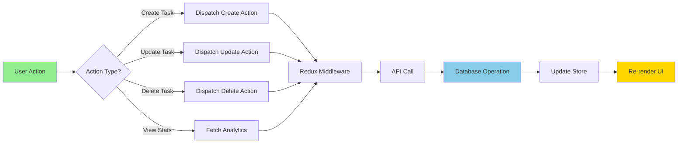
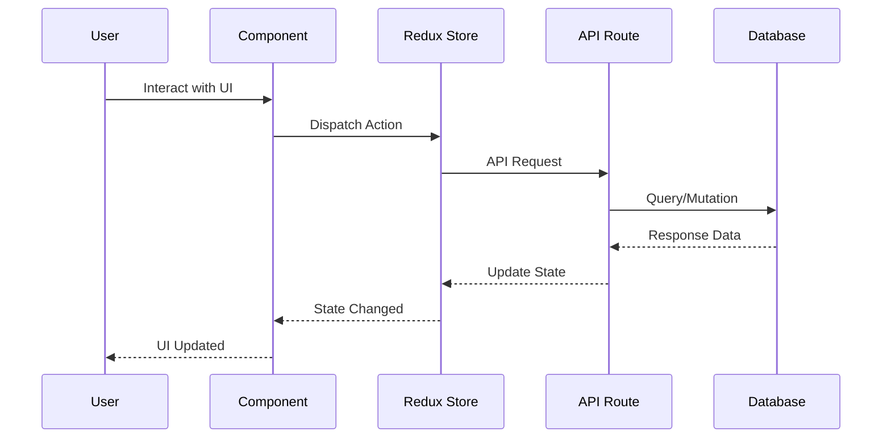
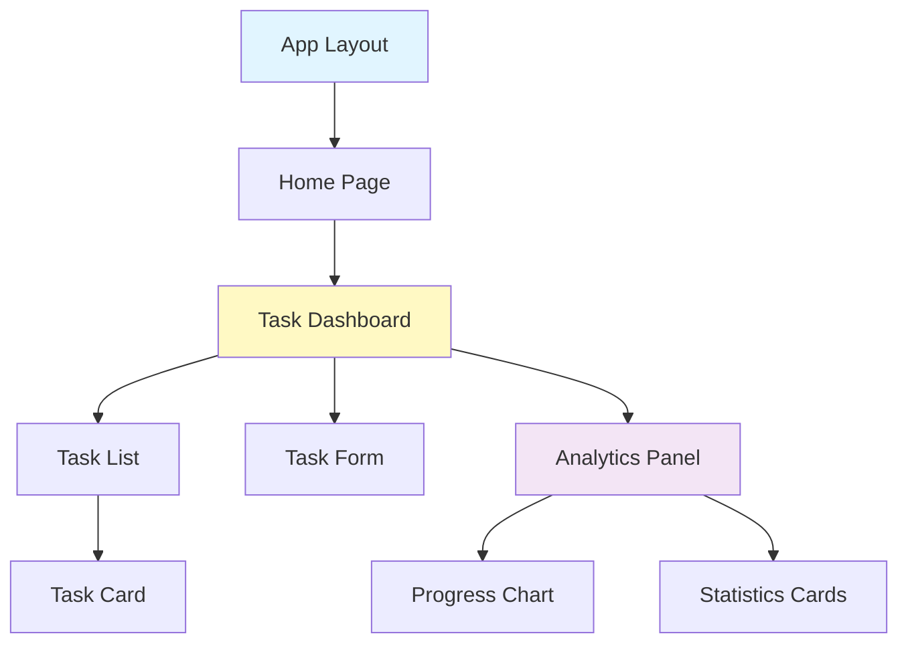
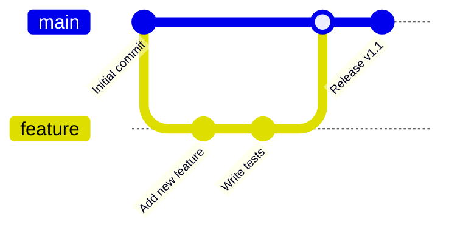

```mermaid
graph TB
    subgraph "Client Layer"
        A[User Interface] --> B[React Components]
        B --> C[Redux Store]
        C --> D[Actions & Reducers]
    end
    
    subgraph "Application Layer"
        E[Next.js App Router] --> F[API Routes]
        F --> G[Business Logic]
    end
    
    subgraph "Data Layer"
        H[Mongoose Models] --> I[(MongoDB Database)]
    end
    
    B --> E
    D --> F
    G --> H
    
    style A fill:#61DAFB
    style E fill:#000000
    style I fill:#47A248
```

# 📊 Productivity Tracker

A modern, feature-rich productivity tracking application built with Next.js 16, TypeScript, and Redux Toolkit. Track your tasks, monitor progress, and visualize your productivity with beautiful charts and animations.

🔗 **Live Demo**: [https://productivity-tracker-pearl.vercel.app](https://productivity-tracker-pearl.vercel.app)


---

## 📑 Table of Contents

- [Features](#-features)
- [Tech Stack](#-tech-stack)
- [Architecture](#-architecture)
- [Application Flow](#-application-flow)
- [Getting Started](#-getting-started)
- [Project Structure](#-project-structure)
- [Available Scripts](#-available-scripts)
- [Usage](#-usage)
- [Deployment](#-deployment)
- [Contributing](#-contributing)

---

## ✨ Features

- 📝 **Task Management** - Create, update, and organize your tasks efficiently
- 📈 **Progress Tracking** - Visual progress indicators with interactive charts
- 🎨 **Modern UI** - Beautiful interface with Radix UI components and Tailwind CSS
- 🎭 **Smooth Animations** - Powered by Framer Motion for delightful user experience
- 💾 **Data Persistence** - MongoDB integration for reliable data storage
- 🔄 **State Management** - Redux Toolkit for predictable state handling
- 📊 **Data Visualization** - Interactive charts using Recharts
- 🌐 **Responsive Design** - Works seamlessly across all devices
- ⚡ **Server-Side Rendering** - Fast initial page loads with Next.js SSR
- 🔒 **Type Safety** - Full TypeScript support for better developer experience

---

## 🛠️ Tech Stack

### Frontend
- **Framework**: [Next.js 16](https://nextjs.org/) with App Router
- **Language**: [TypeScript 5](https://www.typescriptlang.org/)
- **Styling**: [Tailwind CSS 4](https://tailwindcss.com/)
- **UI Components**: [Radix UI](https://www.radix-ui.com/)
- **Animations**: [Framer Motion 12](https://www.framer.com/motion/)
- **Icons**: [Lucide React](https://lucide.dev/)

### State & Data Management
- **State Management**: [Redux Toolkit 2.11](https://redux-toolkit.js.org/)
- **Database**: [MongoDB](https://www.mongodb.com/)
- **ODM**: [Mongoose 9](https://mongoosejs.com/)

### Visualization & Utilities
- **Charts**: [Recharts 3.6](https://recharts.org/)
- **Date Utilities**: [date-fns 4](https://date-fns.org/)
- **Class Utilities**: [clsx](https://github.com/lukeed/clsx) & [tailwind-merge](https://github.com/dcastil/tailwind-merge)

---

## 🏗️ Architecture



---

## 🔄 Application Flow

### User Task Management Flow



### Data Flow Architecture



---

## 🚀 Getting Started

### Prerequisites

Ensure you have the following installed:

```bash
Node.js >= 20.x
npm >= 10.x (or yarn/pnpm/bun)
MongoDB >= 6.x (local or cloud instance)
```

### Installation

**Step 1: Clone the repository**

```bash
git clone https://github.com/MamunCrafts/producivity-tracker.git
cd producivity-tracker
```

**Step 2: Install dependencies**

```bash
npm install
# or
yarn install
# or
pnpm install
# or
bun install
```

**Step 3: Set up environment variables**

Create a `.env.local` file in the root directory:

```env
# Database
MONGODB_URI=your_mongodb_connection_string

# Application
NEXT_PUBLIC_APP_URL=http://localhost:3000

# Optional: For production
NODE_ENV=development
```

**Step 4: Run the development server**

```bash
npm run dev
# or
yarn dev
# or
pnpm dev
# or
bun dev
```

**Step 5: Open your browser**

Navigate to [http://localhost:3000](http://localhost:3000) to see the application in action! 🎉

---

## 📂 Project Structure

```
producivity-tracker/
│
├── 📁 app/                    # Next.js App Router
│   ├── api/                   # API routes
│   ├── layout.tsx             # Root layout
│   └── page.tsx               # Home page
│
├── 📁 components/             # React components
│   ├── ui/                    # Reusable UI components
│   ├── TaskCard.tsx           # Task display component
│   ├── ProgressChart.tsx      # Data visualization
│   └── ...
│
├── 📁 lib/                    # Utility functions
│   ├── utils.ts               # Helper functions
│   └── dbConnect.ts           # Database connection
│
├── 📁 models/                 # Mongoose schemas
│   └── Task.ts                # Task model
│
├── 📁 store/                  # Redux store
│   ├── index.ts               # Store configuration
│   └── slices/                # Redux slices
│
├── 📁 types/                  # TypeScript definitions
│   └── index.ts               # Type declarations
│
├── 📁 public/                 # Static assets
│
├── 📄 package.json            # Dependencies
├── 📄 tsconfig.json           # TypeScript config
├── 📄 tailwind.config.ts      # Tailwind config
└── 📄 next.config.ts          # Next.js config
```

---

## 📜 Available Scripts

| Command | Description |
|---------|-------------|
| `npm run dev` | 🚀 Start development server at `http://localhost:3000` |
| `npm run build` | 🏗️ Build optimized production bundle |
| `npm run start` | ▶️ Start production server |
| `npm run lint` | 🔍 Run ESLint for code quality checks |

---

## 🎯 Usage

### Component Structure Diagram



### Quick Start Guide

1. **Create Your First Task**
   - Click the "Add Task" button
   - Fill in task details (title, description, deadline)
   - Click "Save" to add the task

2. **Track Progress**
   - Mark tasks as complete using the checkbox
   - View completion percentage in the progress bar
   - Monitor trends in the analytics dashboard

3. **Visualize Productivity**
   - Check daily/weekly/monthly charts
   - View task completion rates
   - Analyze productivity patterns

4. **Manage Categories**
   - Organize tasks by projects or categories
   - Filter tasks by status or priority
   - Search and sort tasks efficiently

---

## 🚀 Deployment

### Deploy to Vercel (Recommended)

The easiest way to deploy your Next.js app is using [Vercel](https://vercel.com):

[](https://vercel.com/new/clone?repository-url=https://github.com/MamunCrafts/producivity-tracker)

**Manual Deployment Steps:**

1. Push your code to GitHub
2. Import your repository to Vercel
3. Add environment variables in Vercel dashboard
4. Deploy! 🎉

### Other Deployment Options

- **Docker**: Build and run containerized application
- **AWS/GCP/Azure**: Deploy on cloud platforms
- **Self-hosted**: Use PM2 or similar process managers

Check out the [Next.js deployment documentation](https://nextjs.org/docs/app/building-your-application/deploying) for more details.

---

## 🤝 Contributing

Contributions are welcome! Here's how you can help:



### Contribution Steps

1. **Fork the repository**
2. **Create your feature branch**
   ```bash
   git checkout -b feature/AmazingFeature
   ```
3. **Commit your changes**
   ```bash
   git commit -m 'Add some AmazingFeature'
   ```
4. **Push to the branch**
   ```bash
   git push origin feature/AmazingFeature
   ```
5. **Open a Pull Request**

### Code Style Guidelines

- Follow TypeScript best practices
- Use meaningful variable and function names
- Add comments for complex logic
- Write unit tests for new features
- Ensure all tests pass before submitting PR

---

## 📝 License

This project is open source and available under the [MIT License](LICENSE).

---

## 👤 Author

**MamunCrafts**

- 🐙 GitHub: [@MamunCrafts](https://github.com/MamunCrafts)
- 🌐 Website: [https://productivity-tracker-pearl.vercel.app](https://productivity-tracker-pearl.vercel.app)

---

## 🙏 Acknowledgments

Special thanks to these amazing projects:

- [Next.js](https://nextjs.org/docs) - The React Framework for Production
- [Tailwind CSS](https://tailwindcss.com/) - Utility-first CSS Framework
- [Redux Toolkit](https://redux-toolkit.js.org/) - State Management Made Easy
- [Radix UI](https://www.radix-ui.com/) - Unstyled, Accessible Components
- [Recharts](https://recharts.org/) - Composable Charting Library
- [Framer Motion](https://www.framer.com/motion/) - Production-Ready Animation Library

---

## 📊 Project Status


---

## 🗺️ Roadmap

- [ ] Add user authentication
- [ ] Implement task categories and tags
- [ ] Add dark mode support
- [ ] Create mobile app version
- [ ] Add collaborative features
- [ ] Integrate calendar view
- [ ] Export reports (PDF/CSV)

---

<div align="center">

### ⭐ If you find this project helpful, please consider giving it a star!

**Made with ❤️ by MamunCrafts**

[Report Bug](https://github.com/MamunCrafts/producivity-tracker/issues) · [Request Feature](https://github.com/MamunCrafts/producivity-tracker/issues)

</div>